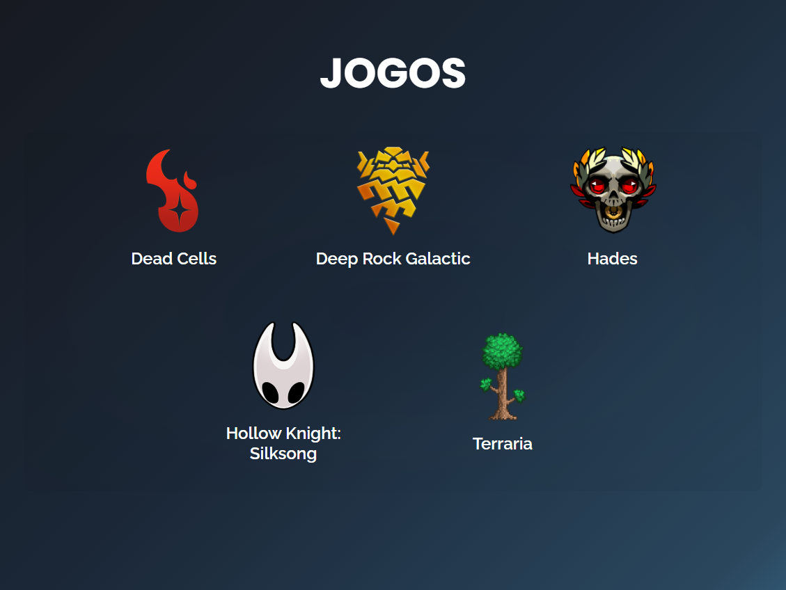
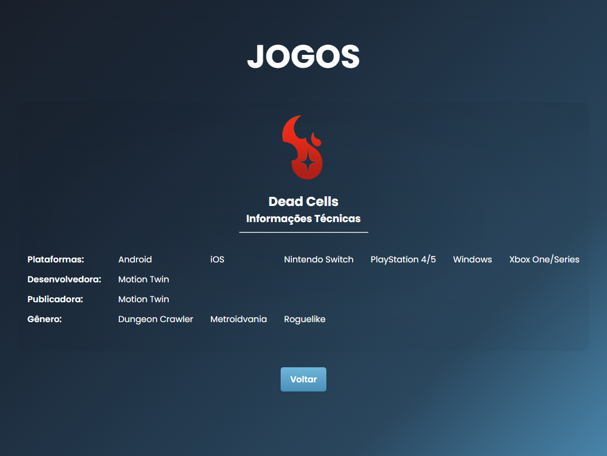

# 🎮 Atividade da AV1 - Games Database

🔗 Link do projeto: [Games Database](https://ramoonlorenzo.github.io/games-database/)

## 📚 Descrição

Este projeto consiste em um site desenvolvido com HTML, CSS e JavaScript, com o objetivo de apresentar informações sobre jogos digitais, funcionando como um pequeno “banco de dados”.

O site permite ao usuário navegar entre diferentes páginas, cada uma contendo informações detalhadas sobre um jogo específico.

## 🎯 Objetivo da Atividade

- Criar um site sobre um tema específico
- Utilizar elementos estudados em sala (Ex: elementos de texto, listas, links, imagens, etc.)
- Desenvolver no mínimo **5 páginas com conteúdos únicos**

## 🎨 Funcionalidades

- Navegação entre páginas com links
- Layout inspirado em plataformas de jogos
- Uso de tabelas para exibição de dados
- Animações suaves (fade in / fade out)
- Organização em pastas (assets, pages, css)

### Estrutura Geral

Visão inicial da página principal e organização dos elementos.



### Detalhamento dos Itens

Detalhamento de como cada item é exibido.



## 📁 Organização de Pastas

```
/games-database
│
├── index.html
│
├── src/assets/
│   └── icons/
│   └── images/
│
├── src/css/
│   └── reset.css
│   └── responsive.css
│   └── styles.css
│   └── variables.css
│
├── src/js/
│   └── index.js
│
├── src/pages/
│   └── dead-cells.html
│   └── deep-rock-galactic.html
│   └── hades.html
│   └── hollow-knight.html
│   └── terraria.html
```

## ⚙️ Tecnologias Utilizadas

- HTML5 (estrutura semântica)
- CSS3 (estilização e layout)
- JavaScript (animações de transição entre páginas)

## 👨🏻‍💻 Autor

- [Ramon Lorenzo](https://github.com/ramoonlorenzo)
